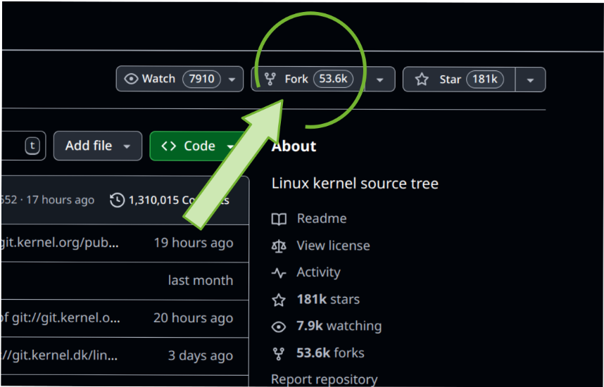
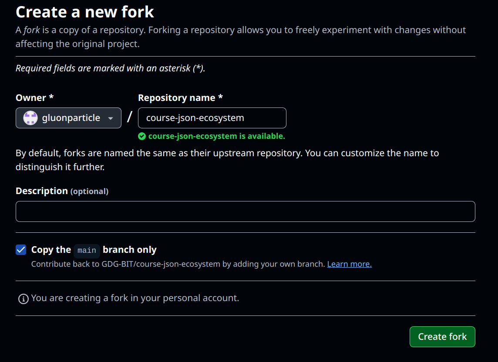
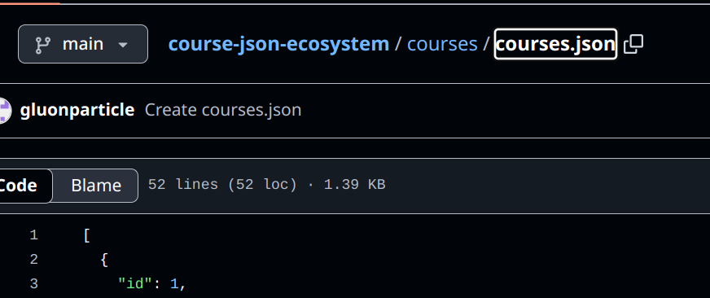
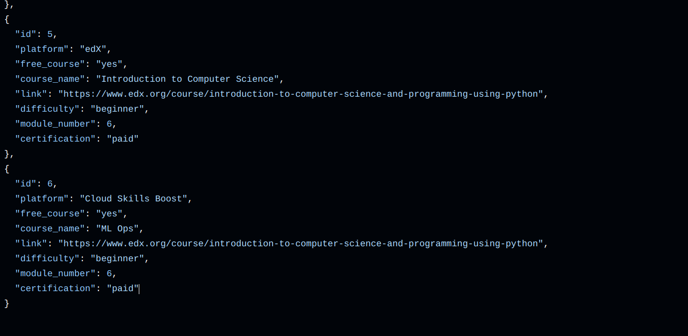
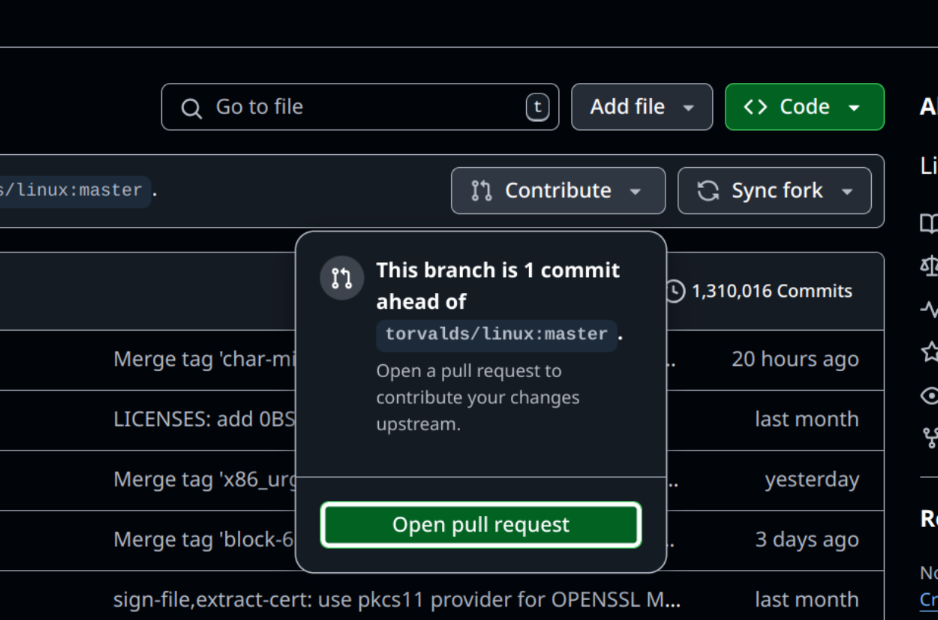
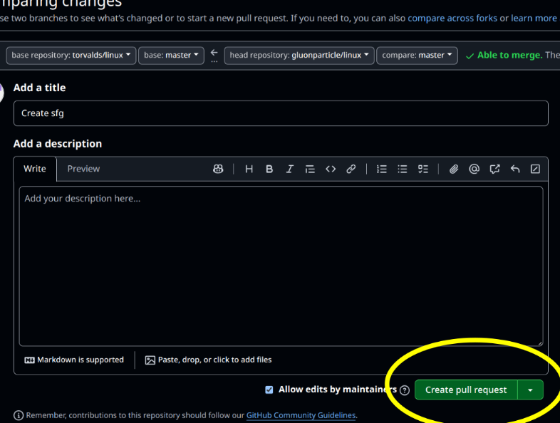

# Guide


We've put together a visual step-by-step guide to help you contribute:

<br><br>

# 1. **Fork the repository:** <br>
    
<br><br><br>
# 2. **Edit the repository name:**  <br>
    
<br><br><br>
# 3. **Navigate to the file you want to edit:** <br>
    
<br><br><br>
# 4. **Add a new JSON course (to `courses.json`):**
    
<br><br>
# 5. **Raise a Pull Request:** 
    
<br><br>
# 6. **Confirm your Pull Request:**
    
<br><br>

# Git Cheat Sheet 

**1. Initialize a new Git repository:**

```bash
git init
```

To use this command, copy the text above and paste it into your terminal. 

**2. Clone an existing repository:**

```bash
git clone https://github.com/username/repository.git
``` 

To use this command, copy the text above, replacing `https://github.com/username/repository.git` with the actual repository URL, and paste it into your terminal.

**3. Check the status of your repository:**

```bash
git status
``` 

To use this command, copy the text above and paste it into your terminal.

**4. Add changes to the staging area:**

```bash
git add . 
``` 

To use this command, copy the text above and paste it into your terminal. 

**5. Commit your changes with a message:**

```bash
git commit -m "Your commit message here"
``` 

To use this command, copy the text above, replace `"Your commit message here"` with your actual commit message, and paste it into your terminal. 

**6. Push your commits to a remote repository:**

```bash
git push origin main
```

To use this command, copy the text above and paste it into your terminal. 

**7. Pull changes from a remote repository:**

```bash
git pull origin main
``` 

To use this command, copy the text above and paste it into your terminal. 

**8. Create a new branch:**

```bash
git branch new-branch-name
``` 

To use this command, copy the text above, replace `new-branch-name` with the desired name for your new branch, and paste it into your terminal. 

**9. Switch to a different branch:**

```bash
git checkout branch-name
``` 

To use this command, copy the text above, replace `branch-name` with the name of the branch you want to switch to, and paste it into your terminal. 

**10. View the commit history:**

```bash
git log
``` 

To use this command, copy the text above and paste it into your terminal. 

**11. Set Your Global Username:**

```bash
git config --global user.name "Your Name"
``` 

To use this command, copy the text above, replace `"Your Name"` with your actual username, and paste it into your terminal.

**12. Set Your Global Email:**

```bash
git config --global user.email "your.email@example.com"
``` 

To use this command, copy the text above, replace `"your.email@example.com"` with your actual email address, and paste it into your terminal.

## Git Cheat Sheet (Table Format)

| Command | Description | Example | 
|---|---|---|
| `git init` | Initializes a new Git repository in the current directory. | ```bash git init ``` | 
| `git clone <repo-url>` | Creates a copy of a remote repository on your local machine. | ```bash git clone https://github.com/username/repository.git ``` | 
| `git add <file>` | Stages changes to a specific file for the next commit. | ```bash git add index.html ``` | 
| `git add .` | Stages all changes in the current directory and its subdirectories for the next commit. | ```bash git add . ``` | 
| `git status` | Shows the status of the working directory and the staging area. | ```bash git status ``` | 
| `git commit -m "message"` | Commits staged changes with a descriptive message. | ```bash git commit -m "Fix bug in login form" ``` |
| `git push <remote> <branch>` | Uploads local commits to a remote repository. | ```bash git push origin main ``` |
| `git pull <remote> <branch>` | Fetches changes from a remote repository and merges them into the local branch. | ```bash git pull origin main ``` | 
| `git branch` | Lists all branches in the local repository. | ```bash git branch ``` |
| `git branch <branch-name>` | Creates a new branch. | ```bash git branch feature/new-design ``` |
| `git checkout <branch-name>` | Switches to a different branch. | ```bash git checkout feature/new-design ``` |
| `git merge <branch-name>` | Merges the specified branch into the current branch. | ```bash git merge feature/new-design ``` | 
| `git branch -d <branch-name>` | Deletes a branch. | ```bash git branch -d feature/new-design ``` | 
| `git log` | Shows the commit history of the current branch. | ```bash git log ``` | 
| `git log --oneline` | Shows the commit history in a condensed format. | ```bash git log --oneline ``` | 
| `git diff` | Shows the differences between the working directory and the last commit. | ```bash git diff ``` | 
| `git diff --staged` | Shows the differences between the staging area and the last commit. | ```bash git diff --staged ``` | 
| `git remote` | Lists all remote repositories. | ```bash git remote ``` | 
| `git remote -v` | Lists all remote repositories with URLs. | ```bash git remote -v ``` |
| `git remote add <remote-name> <repo-url>` | Adds a new remote repository. | ```bash git remote add origin https://github.com/username/repository.git ``` |
| `git remote remove <remote-name>` | Removes a remote repository. | ```bash git remote remove origin ``` |
| `git stash` | Saves uncommitted changes temporarily. | ```bash git stash ``` | 
| `git stash pop` | Restores the most recently stashed changes. | ```bash git stash pop ``` | 
| `git config --global user.name "Your Name"` | Sets your name globally. | ```bash git config --global user.name "Your Name" ``` |
| `git config --global user.email "your.email@example.com"` | Sets your email globally. | ```bash git config --global user.email "your.email@example.com" ``` |

